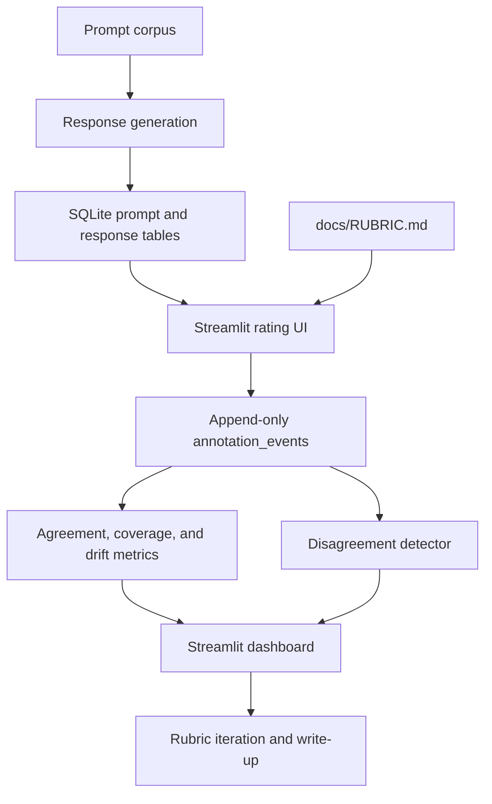

# LLM Output Evaluation Harness

Human-in-the-loop evaluation harness for LLM outputs, built around a versioned rubric, append-only annotation events, disagreement detection, and data quality dashboards.

The project demonstrates how to translate subjective quality policy into a scalable workflow: generate model responses, collect human ratings across multiple axes, detect disagreement, and use those edge cases to revise the rubric. It is single-rater for the demo, with test-retest re-rating standing in for inter-rater reliability.

## What It Shows

- Multi-axis LLM output rubric: factuality, helpfulness, harm, format adherence, refusal appropriateness.
- SQLite-backed annotation store with append-only event logging and rubric version stamps.
- Streamlit rating UI and analytics dashboard.
- Agreement metrics: exact agreement, Cohen's kappa, Krippendorff's alpha, Spearman score correlation.
- Coverage, drift, disagreement, and edge-case clustering views.
- Policy docs and evaluation write-up suitable for a data quality interview portfolio.

## Architecture



## Quickstart

```bash
python -m venv .venv
source .venv/bin/activate
pip install -r requirements.txt
python -m generation.generate_responses --offline
python scripts/seed_demo_annotations.py
streamlit run dashboard/app.py
```

Open the Streamlit URL printed in the terminal.

## Optional API Generation

Create `.env` from `.env.example` and set:

```bash
ANTHROPIC_API_KEY=...
OPENAI_API_KEY=...
```

Then run:

```bash
python -m generation.generate_responses
```

If a key is missing, that provider falls back to deterministic offline responses.

## Project Structure

```text
docs/                 Rubric, policy, write-up, architecture
prompts/              Demo prompt corpus and curation notes
generation/           Response generation and response storage
annotation/           Streamlit rating UI, rubric loader, annotation store
eval/                 Agreement, coverage, drift, and edge-case metrics
dashboard/            Multi-page Streamlit dashboard
tests/                Unit tests for metrics and storage
```

## Demo Limitations

This is a single-rater proof of methodology, not a vendor-scale labeling operation. It uses synthetic public-demo prompts and SQLite. At scale, the event log would move to a warehouse or stream, and the same contracts would support rater calibration, adjudication, privacy controls, and vendor scorecards.
