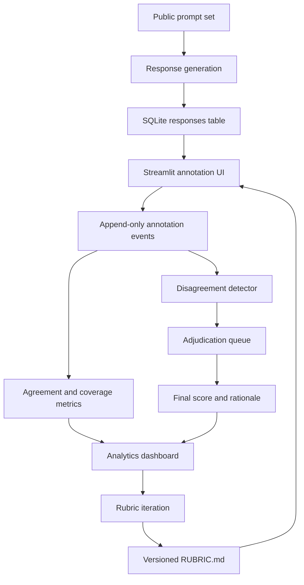

# Architecture

## Design Choices

Append-only annotation events preserve every rating with timestamp and rubric version. This makes replays possible when policy changes and prevents silent data mutation.

The rubric is stored as Markdown because policy needs to be legible to engineers, data quality leads, and raters. The application parses headings and score definitions into structured UI controls.

Disagreement is treated as a first-class metric. Low agreement is not just a data quality failure; it is often the best signal that the policy is underspecified.

Adjudication turns disagreement into a resolved quality signal. The dashboard captures final scores, resolution type, and rationale so that policy owners can separate rater error, rubric ambiguity, data issues, and true model quality failures.

The demo runs on SQLite to stay portable. The schema is intentionally compatible with a warehouse-backed implementation: prompts, responses, rubric versions, annotation events, and review flags all map cleanly to production tables.
